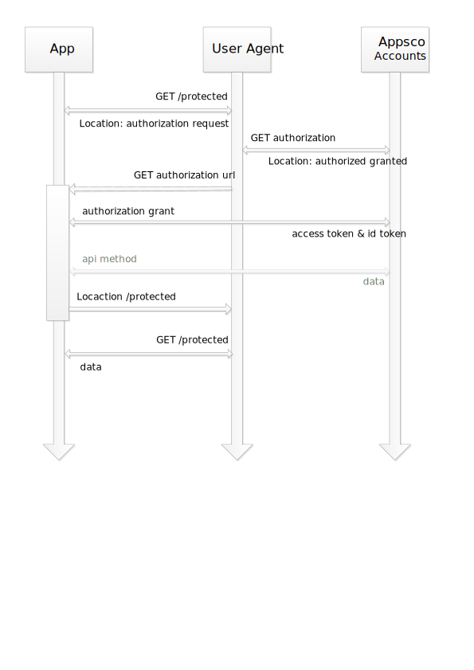

Appsco Accounts OAuth v2
========================

OAuth2 is a protocol that lets applications request authorization to details of Appsco Accounts user's account
without getting their passwords. Applications using granted authorization tokens can call Appsco Accounts API
and impersonate users that gave the authorization for the given scope. Users can revoke given access token
at any time.

All applications has to be registered on [Appsco Accounts](https://accounts.dev.appsco.com) in order to be able
to use its API. Each registered app is given a unique Client ID and Client Secret. The Client Secret should not be
shared and given to any third parties.

[

Reference
---------

 * [IETF OAuth 2.0 WG specification](http://tools.ietf.org/html/rfc6749)
 * [OAuth OpenID Connect Core](http://openid.net/specs/openid-connect-core-1_0.html)
 * [Wikipedia](http://en.wikipedia.org/wiki/OAuth)


Web Application Flow
====================

Following is a description of the OAuth2 for web applications.

1. Redirect users to request Appsco Accounts access
---------------------------------------------------

    GET https://accounts.dev.appsco.com//oauth/authorize


Parameters
----------

| Name            | Type        | Description
| --------------- | ------------ | ------------
| `client_id`     | `string`     | **Required** The Client ID you received when you registered the app
| `redirect_uri`  | `string`     | The URL in your app where users will be sent after authorization. See details below about [redirect urls](#redirect-urls).
| `scope`         | `string`     | Space separated list of [scopes](#scopes). If not provided defaults to `profile_read`
| `state`         | `string`     | An unguessable random string. It is used to protect against cross-site request forgery attacks.


2. Appsco Accounts redirects back to your site
----------------------------------------------

If the user accepted your request and gave you the authorization for requested scope, Appsco Accounts redirects back
to your site with a temporary code in the `code` parameter together with the state you provided in the previous request
in the `state` parameter. If the state does not match, the request is made by third party and the process should be
aborted.

Exchange the temporary code for access token.

    POST https://accounts.dev.appsco.com/api/v1/token/get

Parameters
----------

| Name                | Type        | Description
| ------------------- | ------------ | ------------
| `client_id`         | `string`     | **Required** The Client ID you received when you registered the app
| `client_secret`     | `string`     | **Required** The Client Secret you received when you registered the app
| `code`              | `string`     | The code you received as a response to previous request
| `redirect_uri`      | `string`     | The URL in your app where users will be sent after authorization. See details below about [redirect urls](#redirect-urls).

The response will take the following form

``` json
{
    "access_token": "2z0z3okj0ha8skg400wo440ogwssg0k8csg4wogcw4w0ckggow",
    "scope": "profile_read",
    "token_type": "bearer",
    "id_token": "d8r781oclb4gg4wwc0wc8c848wc4ok4kc400wks4o0cs88gcou9lhwjkc3msws0g8c4osgc0kw8ckkcwwws4gwocwgowsgk4g8"
}
```

3. Use the access token to access the Appsco Accounts API
---------------------------------------------------------

The obtained access token allows you to make requests to the Appsco Accounts API on behalf of the user that gave
you the authorization.

    GET https://accounts.dev.appsco.com/api/v1/profile/me?access_token=...

You can pass the token as the query param as shown above, but safer and cleaner way is to include it in the
Authorization header

    Authroization: token THE-OAUTH-ACCESS-TOKEN

For example, wuth curl you can set the Authorization header with following command:

    curl -H "Authroization: token THE-OAUTH-ACCESS-TOKEN" https://accounts.dev.appsco.com/api/v1/profile/me


Redirect URLs
=============

The `redirect_uri` parameter is optional. If left out, Appsco Accounts will redirect users to the callback URL
configured in the application settings. If provided, the redirect URL’s host and port must exactly match the
callback URL. The redirect URL’s path must reference a subdirectory of the callback URL.


Scopes
======

| Name                | Description
| ------------------- | ------------
| `profile_read`      | Grants read-only access to profile information
| `profile_write`     | Grants read/write access to profile info. This scope includes `profile_read`
| `app_read`          | Grants read access to user's registered applications
| `app_write`         | Grants read/write access to user's registered applications
| `users_read`        | Grants read access to other user accounts in the same user directory
| `users_write`       | Grants read/write access to other user accounts in the same user directory


Errors
======

Application Suspended
---------------------

Lorem ipsum...

Redirect URI mismatch
---------------------

Lorem ipsum...

Access denied
-------------

Lorem ipsum...


Incorrect client credentials
----------------------------

Lorem ipsum...


Bad verification code
---------------------

Lorem ipsum...

